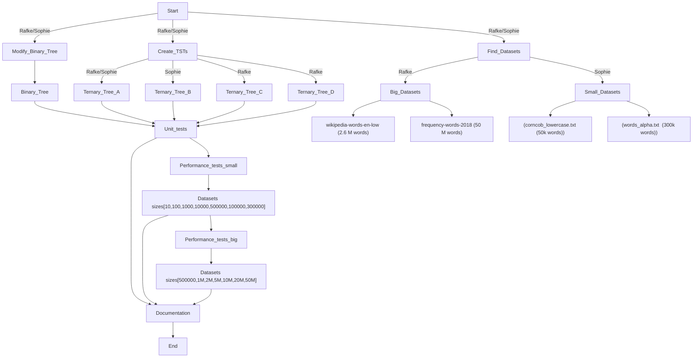

# Concept of Data Science 2024-2025 - Implementation of a Tenary Search Tree

## Project Description :
The project aims at implementing a ternary search tree using Python.
The goal is to explore different ternary search trees and explore their efficiencies in handling searches and insertions. The goal is also to test their performance with small and large dataset on an HPC infrastuctures. 
The following flowchart presents our strategy.

## Contents and how to run the Project
We started by developing our first ternary search tree (TST) `ternary_tree.py` using an object-oriented approach in Python, based on the binary tree from the course materials. To meet the requirements for prefix searches and exact searches, we made slight modifications to the binary tree structure in  `btree.py`. \
After that, we divided our work into creating three or more different TSTs, each with unique performance characteristics: an iterative version `ternary_tree_B.py`, a sparse version `ternary_tree_minimalistic.py`, and a highly recursive version `ternary_tree_recursive.py`. \
Alongside the implementation, we searched for various datasets—including small samples like the `corncob_lowercase.txt` dataset from the course, the `words_alpha.txt` dataset, as well as larger datasets exceeding one million words. We took two large datasets (one from `wikipedia` words, and the other from `frequency_words` in 2018). It was assumed that the variety and complexity of words in the wikipedia dataset is larger than the frequency words where this is more a quantitative dataset that could lead to some differences in the inserting and searching times. \
To ensure correctness, we performed unit tests for our different trees, making sure they passed a set of edge cases we designed in the `test_tst.py`. Once all trees were properly refactored and functional, we conducted performance tests using datasets of various sizes. These tests measured the insert and search speed of each TST under different conditions. The binary tree was also evaluated together with those TST.
For smaller dataset benchmarks, we performed the test locally, where the results are available in the Jupyter Notebook in `tst_implementations.ipynb`. We used the `corncob_lowercase` and `words` dataset.
For large dataset benchmarks, we used High Performance Computing (HPC) infrastructure with Vlaamse Supercomputing Centrum, and analyzed the results by generating performance plots. \
Our project includes an evaluation of best, average, and worst-case scenarios, helping us understand the efficiency of our implementations.

## How to use the project

## Performance Testing : Small Datasets

## Performance Testing : Large Datasets using HPC infrastructure

## Performance Testing : Comparison with B-Trees

## Discussion : Time and Space Complexity

## Conclusion
