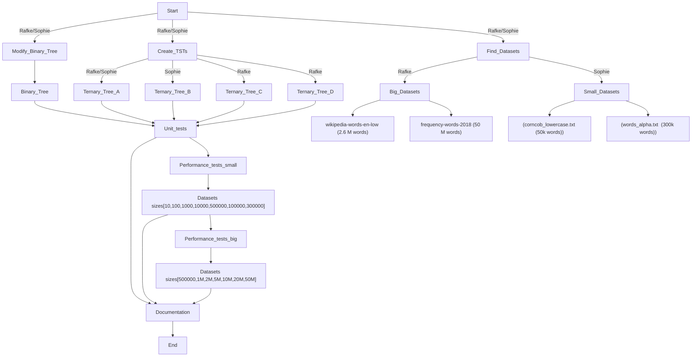
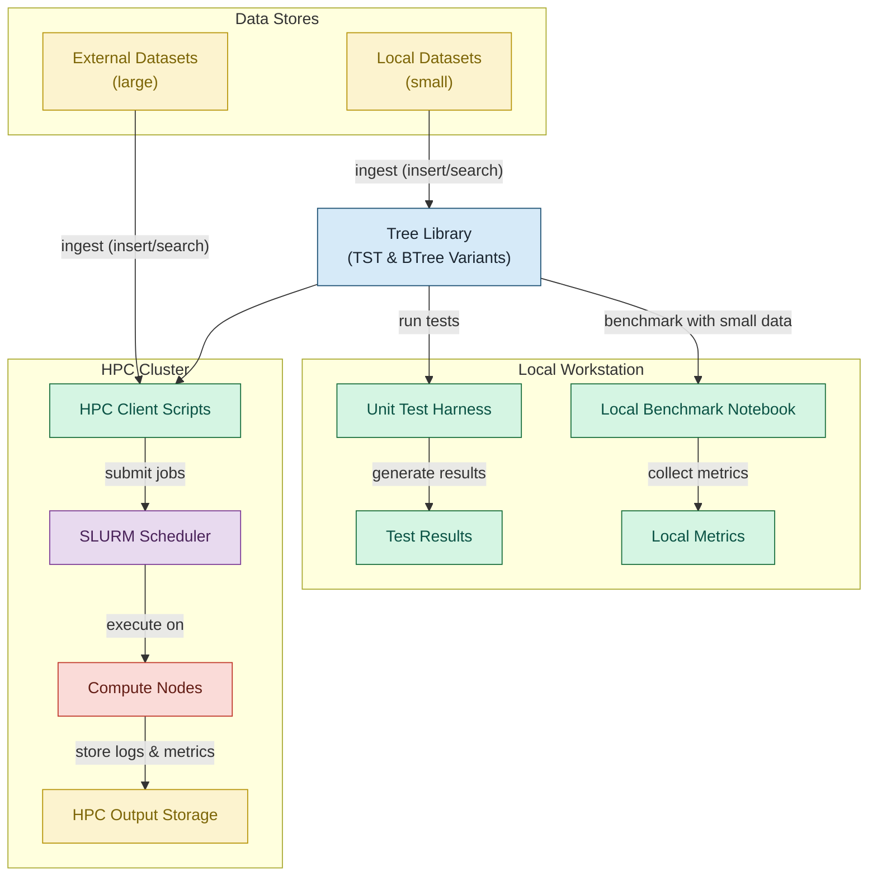

# Concept of Data Science 2024-2025 - Implementation of a Tenary Search Tree

## Project Description :
The project aims at implementing a ternary search tree using Python.
The goal is to explore different ternary search trees and explore their efficiencies in handling searches and insertions. The goal is also to test their performance with small and large dataset on an HPC infrastuctures. 
The following flowchart illustrates our strategy.

## Repository structure 
And below is a more comprised diagram, showing the working of the repository. 

## Contents and how to run the Project
We started by developing our first ternary search tree (TST) `ternary_tree.py` using an object-oriented approach in Python, based on the binary tree from the course materials. To meet the requirements for prefix searches and exact searches, we made slight modifications to the binary tree structure in  `btree.py`. \
After that, we divided our work into creating three or more different TSTs, each with unique performance characteristics: an iterative version `ternary_tree_B.py`, a sparse version `ternary_tree_minimalistic.py`, and a highly recursive version `ternary_tree_recursive.py`. \
Alongside the implementation, we searched for various datasets—including small samples like the `corncob_lowercase.txt` dataset from the course, the `words_alpha.txt` [^1] dataset, as well as larger datasets exceeding one million words. We took two large datasets (one from `wikipedia` words [^2], and the other from `frequency_words` in 2018[^3]). It was assumed that the variety and complexity of words in the wikipedia dataset is larger than the frequency words where this is more a quantitative dataset that could lead to some differences in the inserting and searching times. \
To ensure correctness, we performed unit tests for our different trees, making sure they passed a set of edge cases we designed in the `test_tst.py`. Once all trees were properly refactored and functional, we conducted performance tests using datasets of various sizes. These tests measured the insert and search speed of each TST under different conditions. The binary tree was also evaluated together with those TST.
For smaller dataset benchmarks, we performed the test locally, where the results are available in the Jupyter Notebook in `tst_implementations.ipynb`. We used the `corncob_lowercase` and `words` dataset. \
For large dataset benchmarks, we used High Performance Computing (HPC) infrastructure with Vlaamse Supercomputing Centrum [^4]. \
The output results and the scripts are available in the `HPC` folder.

## Performance Testing : Small Datasets
In smaller datasets, **recursive trees** show relatively stable insertion times but with some fluctuations, indicating possible efficiency changes at different scales. That can be explained by the overhead of recursive function calls, becoming more noticeable depending on data distribution and tree depth. **Iterative trees** have inconsistent performance, with near-zero values at some sample sizes but increasing times at larger sizes. **Sparse trees** maintain generally lower and more predictable times, suggesting moderate efficiency in handling structured data. **B-trees** excel at small sample sizes, showing zero times for up to 1,000 entries, before gradually increasing at **10,000 and beyond**, reinforcing their ability to manage small-scale datasets efficiently. That reflects the B-trees strength of a balanced structure and node-level storage, which minimizes insertion operations for small datasets.  Overall, **B-trees are the best choice for small data**, while **iterative trees show unpredictability**, and **recursive and sparse trees demonstrate moderate but stable performance** based on the data provided. 

## Performance Testing : Large Datasets using HPC infrastructure

### Datasets as.txt files
Based on the result data generated in the HPC (available in the Output folder), we observed that B-trees consistently show the fastest insertion and searching times, making them the most efficient overall, while recursion-based TST struggles at larger sample sizes, even failing at 50M entries (recursion depth exceeded error). Iterative trees offer stable performance, maintaining reasonable insertion and search times without extreme jumps, whereas sparse trees show increasing complexity as sample sizes grow. Exact searching times remain low for smaller sample sizes but increase significantly for larger datasets. The presence of errors in recursion and some inconsistencies in sparse tree performance suggest scalability challenges, whereas B-trees remain consistently efficient even as data size grows. This analysis highlights the importance of selecting the right tree structure based on dataset size and operational requirements.

### Datasets .pkl files

## Performance Testing : Comparison with B-Trees

## Discussion : Time and Space Complexity
When the input list is sorted or semi-sorted, a ternary search tree (TST) can become unbalanced, degrading its insertion time complexity from O(log n) to O(n), thus making it linear link of nodes, while its space complexity remains O(n). This happens because each character comparison may consistently follow only left or right branches, never balancing across all three, which causes the TST to behave like a linked list. \
As a result, longer paths are created, and more edges must be traversed, leading to significantly higher insertion times. In recursive TST implementations, this imbalance is worsened by deep recursion, which can trigger a RecursionError, as seen in `ternary_tree.py` and `ternary_tree_recursive.py`. \
Consequently, the shorter the path, the better the dependencies are captured. Additionally, to allow models to learn these long-term patterns, the historical input to the models should also be long and in that case a low time and space complexity becomes even more relevant. 
Next, `ternary_tree_B.py` and `ternary_tree_minimalistic.py` exhibit excessive memory usage (up to ~10 GB) due to either added metadata or lack of object overhead prevention, leading to large numbers of unshared nodes and deeper nesting. 
Moreover, `ternary_tree_minimalistic.py` includes no optimization properties resulting in every insert spawning new nodes. \
In contrast, `btree.py` remains efficient (~5.3 GB) due to its compact structure, shallow depth, iterative insertion, and storage of multiple keys per node, which significantly reduces the number of node allocations. In a TST, n refers to the number of strings, with each insert potentially creating one node per character, while in a BST, n typically represents full words. \
The sparse structure of unoptimized TSTs means more pointers and strings are stored per word; therefore, it is more efficient to prefix or compress shared paths. If words are long and share prefixes, TSTs are more space-efficient. Ultimately, poor tree balance leads not only to degraded performance but also to increased memory consumption, especially when large and sorted datasets are involved.

## Conclusion

## References:

[^1]: [DWYL English Words](https://github.com/dwyl/english-words/blob/master/words_alpha.txt) – A dataset containing a comprehensive list of English words.  
[^2]: [Hugging Face Wikipedia Words](https://huggingface.co/datasets/kossnocorp/wikipedia-words-en-low) – A dataset of English words extracted from Wikipedia for NLP tasks.  
[^3]: [Frequency Words 2018](https://huggingface.co/datasets/StephanAkkerman/frequency-words-2018) – A dataset of frequently used English words based on 2018 language data.  
[^4]: [KU Leuven HPC On-Demand](http://ondemand.hpc.kuleuven.be/) – A platform for accessing high-performance computing resources at KU Leuven.
[^5]: Liu, S., Yu, H., Liao, C., Li, J., Lin, W., Liu, A. X., & Dustdar, S. (2022). Pyraformer: Low-Complexity Pyramidal Attention for Long-Range Time Series Modeling and Forecasting. In Proceedings of the Tenth International Conference on Learning Representations (ICLR 2022). https://doi.org/10.34726/2945
